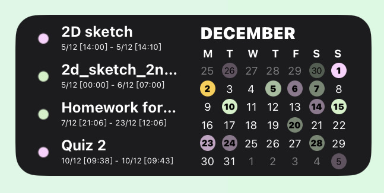
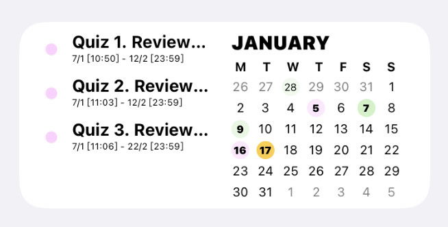
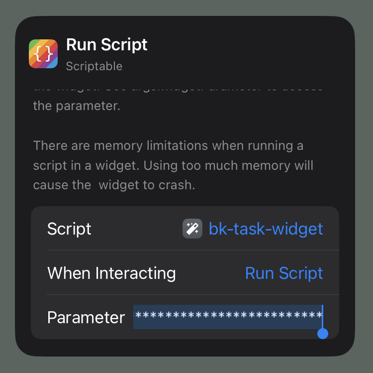
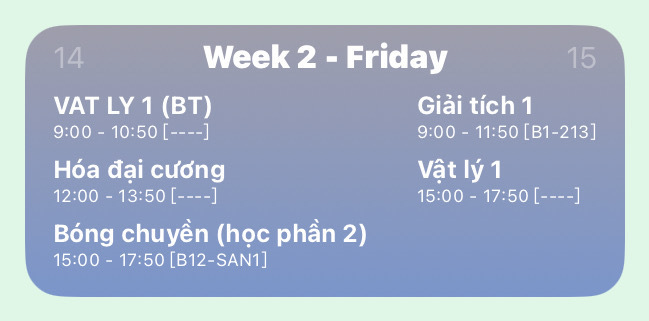
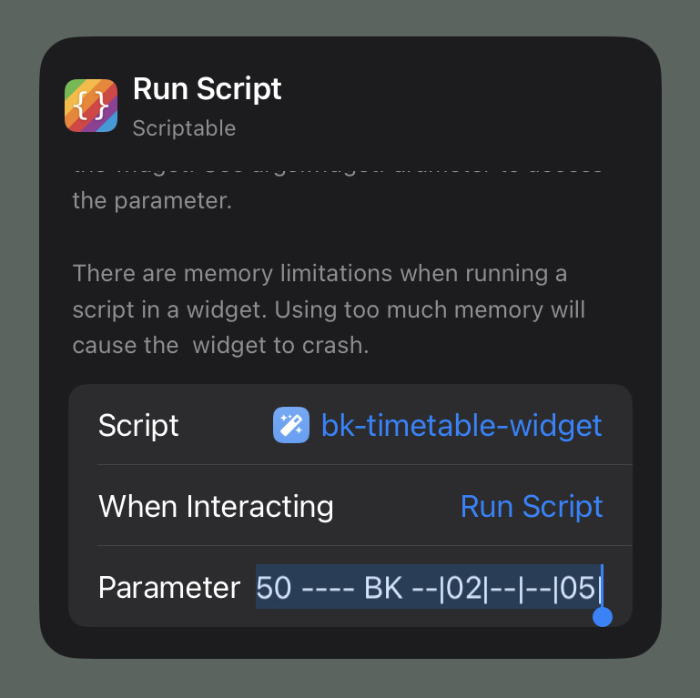

# BK-Widget
The following widgets are only be used by students studying at [Ho Chi Minh University of Techology (HCMUT)](https://hcmut.edu.vn)

## Widgets List
- [Bk-Task-Widget](#bk-task-widget)
- [Bk-Timetable-Widget](#bk-timetable-widget)

## BK-Task-Widget

### ABOUT
This project is an iOS widget made with [Scriptable](https://scriptable.app), which clearly displays subjects' tasks.

#### Description
- Show all available tasks (quizzes, assignments of subjects) in the current month through the calendar.
- Display up to 4 upcoming tasks in detail from present.

#### Restriction
Only available for medium-sized widget.

### USAGE
1. Download [Scriptable (iOS)](https://apps.apple.com/app/id1405459188).
2. Open the app and create new file.
3. Copy all the code from [bk-task-widget.js](https://github.com/datdadev/BK-Timetable-Widget/blob/main/bk-task-widget.js) and paste into the compiler in the app.
4. Visit https://e-learning.hcmut.edu.vn/user/managetoken.php then login into your account, copy the **Key** for the **Moodle mobile web service**.
> Do not share this key for anyone else
5. Create a medium-sized widget at homescreen and edit it, select the file you just created and paste the **Key** into the parameter text field.

## BK-Timetable-Widget

### ABOUT
This project is an iOS widget made with [Scriptable](https://scriptable.app), which displays the today's and tomorrow's timetable.

#### Restriction
Better works with medium-sized or larger size iOS widget for the better view.

### USAGE
1. Download [Scriptable (iOS)](https://apps.apple.com/app/id1405459188).
2. Open the app and create new file.
3. Copy all the code from [bk-timetable-widget.js](https://github.com/datdadev/BK-Timetable-Widget/blob/main/bk-timetable-widget.js) and paste into the compiler in the app.
4. Visit https://mybk.hcmut.edu.vn/stinfo/ then login into your account, click at timetable tab and copy your entire timetable in the selected semeter as text, except for the row header.
5. Create a medium-sized (or larger size) widget at homescreen and edit it, select the file you just created and paste the timetable into the parameter text field.

